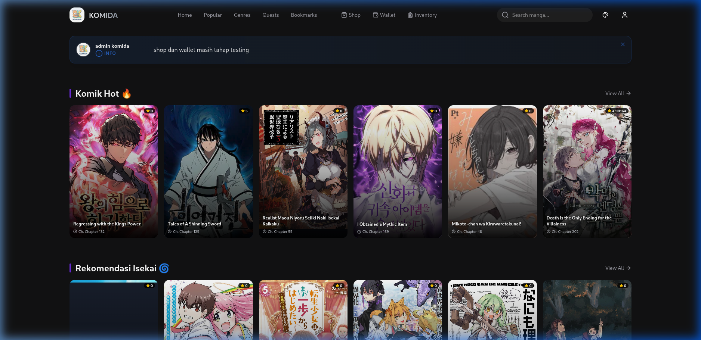
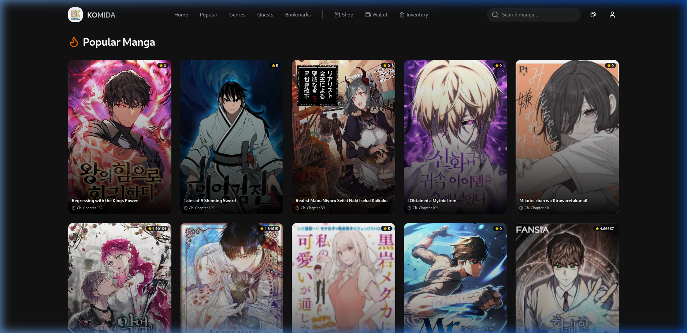
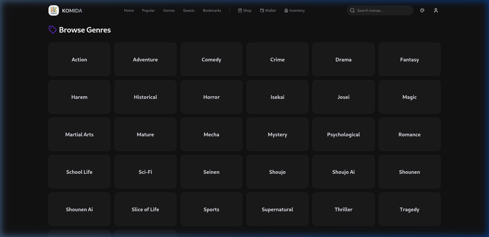

# 📚 Komida - Modern Manga Reader

Komida is a high-performance, modern manga, manhwa, and manhua reader web application built with Next.js 16, Tailwind CSS, and Framer Motion.



## ✨ Features

- **Modern UI/UX**: Stunning dark-themed interface with smooth animations.
- **Optimized Performance**: Zero-lag scrolling and instant navigation using Next.js Loading Skeletons.
- **Comprehensive Library**: Browse through Popular, Genres, and Latest Updates.
- **Shop & Economy**: Purchase decorations and manage your credits.
- **Web3 Integration**: Wallet support for payments and microtransactions.

---

## 🚀 Getting Started

### Prerequisites

- [Bun](https://bun.sh/) (Recommended) or Node.js 18+
- Backend server running (refer to the backend README)

### Installation

1. **Clone the repository**:
   ```bash
   git clone https://github.com/gede-cahya/komida.git
   cd komida
   ```

2. **Install dependencies**:
   ```bash
   bun install
   ```

3. **Configure Environment Variables**:
   Create a `.env.local` file in the root directory:
   ```env
   NEXT_PUBLIC_API_URL=http://localhost:3481/api
   NEXT_PUBLIC_TENOR_API_KEY=your_tenor_key
   ```

4. **Run the development server**:
   ```bash
   bun run dev
   ```

5. **Build for production**:
   ```bash
   bun run build
   bun run start
   ```

---

## 🛠️ Tech Stack

- **Framework**: [Next.js 16](https://nextjs.org/)
- **Styling**: [Tailwind CSS 4](https://tailwindcss.com/)
- **Animations**: [Framer Motion](https://www.framer.com/motion/)
- **Icons**: [Lucide React](https://lucide.dev/)
- **State Management**: [TanStack Query](https://tanstack.com/query)
- **Authentication**: Custom Supabase + SIWE integration

---

## 📸 Screenshots




